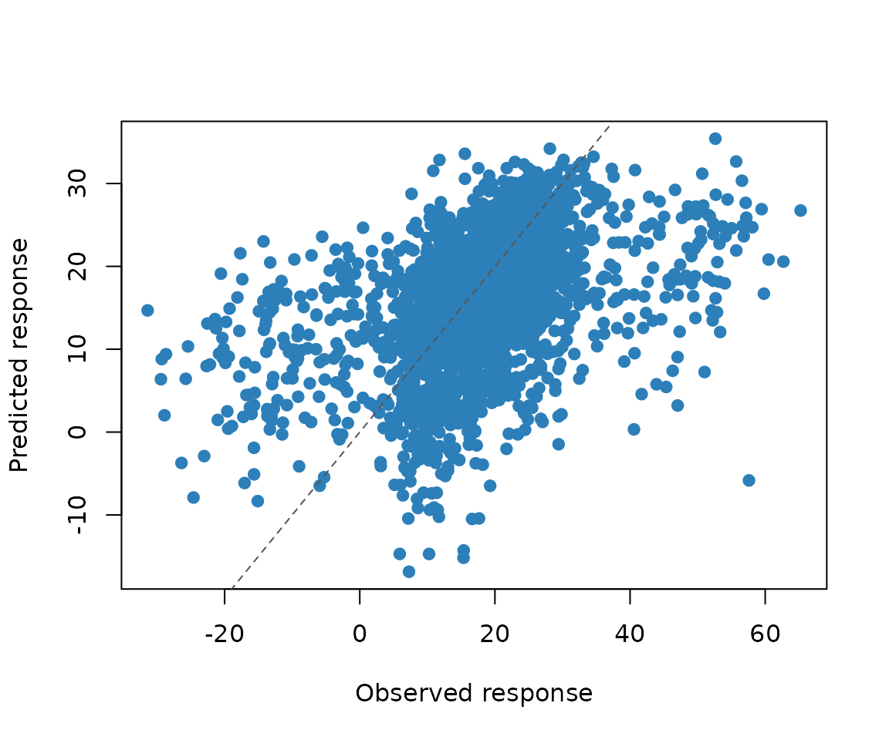

# Get started with magp

`magp` models experiments in which every component has two features: an
amount and a position in an ordered sequence. A formulation experiment,
for example, may vary both the amount of each ingredient and the order
in which the ingredients are added.

This article fits the compact two-dimensional model, predicts held-out
responses, and obtains predictive uncertainty.

## Input layout

For `q` components, each row has `2 * q` input columns. The first `q`
columns contain quantitative levels. The remaining columns contain a
permutation of `1:q`, describing the component positions in that run.

``` r

library(magp)

train <- read.table(
  system.file("extdata", "example_train.txt", package = "magp"),
  header = TRUE
)
test <- read.table(
  system.file("extdata", "example_test.txt", package = "magp"),
  header = TRUE
)

train[1:3, ]
#>            A         B          C         D a b c d        y
#> 1 0.24193548 0.2419355 0.37096774 0.1129032 1 2 3 4 24.92158
#> 2 0.01612903 0.6612903 0.98387097 0.4032258 1 2 4 3 21.40920
#> 3 0.33870968 0.7258065 0.08064516 0.3387097 1 2 4 3 22.23420
```

The example contains four quantitative columns (`A` through `D`), four
sequence-position columns (`a` through `d`), and a response named `y`.
Because the response column is named `y`, the fitting function can
identify it and infer `q` directly.

## Fit the two-dimensional model

``` r

fit <- magp2d_fit(
  train,
  seed = 1,
  maxeval = 100
)
fit
#> <magp2d model>
#>   components: 4 
#>   training runs: 31 
#>   nugget: 0.001 
#>   fitted mean: 15.7967 
#>   objective: 235.4236 
#>   optimizer: converged (status 4 )
```

To fit the model from multiple parameter starts, set `n_starts` above
one. Setting `workers` above one runs those starts in separate local R
processes.

``` r

fit <- magp2d_fit(
  train,
  seed = 1,
  n_starts = 8,
  workers = 2
)
```

## Predict new runs

``` r

prediction <- predict(
  fit,
  test,
  se.fit = TRUE,
  type = "response"
)

comparison <- data.frame(
  observed = test$y,
  predicted = prediction$fit,
  standard_error = prediction$se.fit
)
head(comparison)
#>    observed predicted standard_error
#> 1 17.424048  17.13052       30.50386
#> 2 27.443544  29.49620       32.70545
#> 3 12.505682  13.28978       34.35567
#> 4 15.391038  22.30868       32.00704
#> 5  9.994182  11.40215       31.87554
#> 6 23.182836  10.49296       31.56366
magp2d_rmse(comparison$predicted, comparison$observed)
#> [1] 11.44883
```

`type = "response"` includes the nugget variance for a future response.
Use `type = "latent"` when uncertainty about the underlying noise-free
surface is the target.

``` r

plot(
  comparison$observed,
  comparison$predicted,
  xlab = "Observed response",
  ylab = "Predicted response",
  pch = 19,
  col = "#2c7fb8"
)
abline(0, 1, lty = 2, col = "#555555")
```



## Use the full mapping

The full model has the same input and prediction interface. Only the
fitting function changes.

``` r

fit_full <- magpfull_fit(train, seed = 1)
predict(fit_full, test, se.fit = TRUE, type = "response")
```

The compact and full models represent sequence positions differently. It
is often useful to compare their predictive performance for the
application at hand rather than choosing only from model size.

## Citation

Run the following command for the software citation and the associated
methodology paper.

``` r

citation("magp")
#> To cite magp, please cite the software: The statistical methodology is
#> described in:
#> 
#>   Wang T, Xiao Q (2026). _magp: Mapping-Based Additive Gaussian Process
#>   Models_. doi:10.32614/CRAN.package.magp
#>   <https://doi.org/10.32614/CRAN.package.magp>. R package version
#>   0.12.0, <https://CRAN.R-project.org/package=magp>.
#> 
#>   Xiao Q, Wang Y, Mandal A, Deng X (2024). "Modeling and Active
#>   Learning for Experiments with Quantitative-Sequence Factors."
#>   _Journal of the American Statistical Association_, *119*(545),
#>   407-421. doi:10.1080/01621459.2022.2123335
#>   <https://doi.org/10.1080/01621459.2022.2123335>.
#> 
#> To see these entries in BibTeX format, use 'print(<citation>,
#> bibtex=TRUE)', 'toBibtex(.)', or set
#> 'options(citation.bibtex.max=999)'.
```
